#  Manual de instalación y configuración de Django

1.	Como primer paso es entrar en el emulador de consola para Windows cmder. Una vez entrando, ejecutamos los siguientes comandos.

2.	En zona raíz, creamos una carpeta llamada mkfdir django.

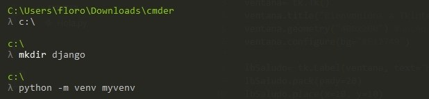

3.	Con el comando cd entramos a la carpeta djando.

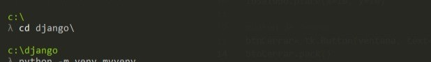

4.	Una vez entrando en la carpeta de django, escribimos el comando python -m venv myvenv, en el cual nos va a permitir crear un entorno virtual en Python llamado myvenv.
Un entorno virtual es una carpeta aislada donde se almacenan versiones específicas de Python y paquetes instalados, evitando conflictos con otras versiones del sistema.

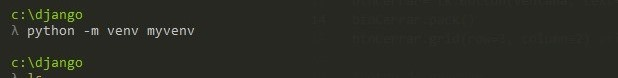

5.	Posteriormente escribimos ls para ver los archivos dentro djando.

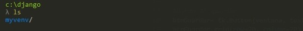

6.	con los comandos myvenv/Scripts/actívate, activa el entorno virtual y myvenv/Scripts/deactívate, desactiva el entorno virtual. Como estamos iniciando lo dejamos activado.

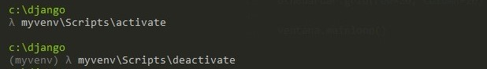

7.	 El comando python -m pip install --upgrade pip, se utiliza para actualizar pip, el gestor de paquetes de Python, a su versión más reciente.

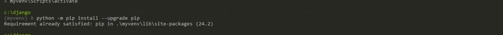

8.	Ahora bien, escribimos python -m pip install Django nos permite descargar e instalar la versión más reciente de Django.

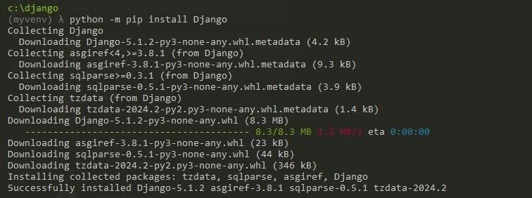

9.	creamos un nuevo proyecto Django llamado mysite en el directorio actual, django-admin startproject mysite . el punto indica que el proyecto debe ser creado en la carpeta actual, en lugar de crear una nueva carpeta para el proyecto.

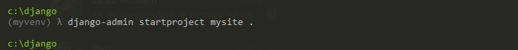

10.	Iniciamos el servidor web de desarrollo integrado en Django, con el siguiente comando python manage.py runserver.

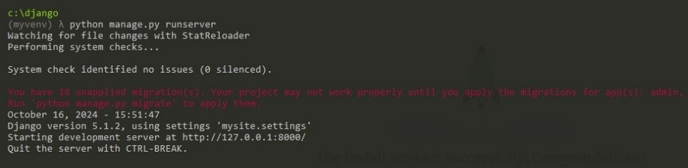
	
11.	Dentro de ello, podemos acceder a la aplicación escribiendo http://127.0.0.1:8000/ en nuestro navegador.

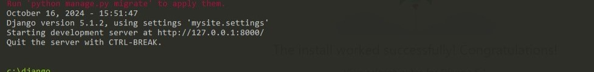

12.	El comando python manage.py migrate aplica las migraciones de la base de datos en un proyecto Django.

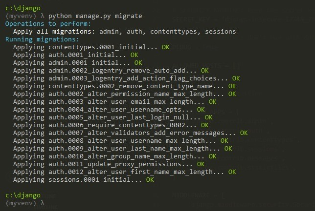

13.	continuamos con la creación del superusuario en un proyecto Djando con el comando python manage.py createsuperuser. Donde escribimos el nombre de usuario, correo electrónico y una respectiva contraseña.

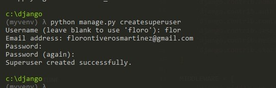

14.	Para volver a ingresar a la aplicación, iniciamos el servidor nuevamente python manage.py runserver.

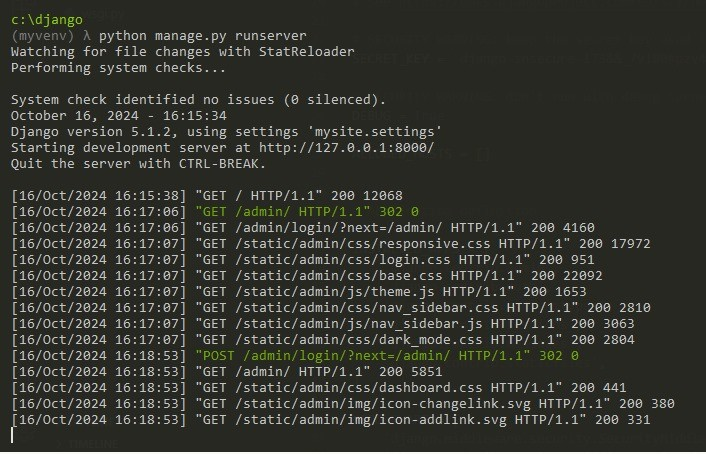

15.	volvemos a acceder en nuestro navegador http://127.0.0.1:8000/admin/, para este caso agregamos el admin en el cual se refiere al panel de administración de Django.

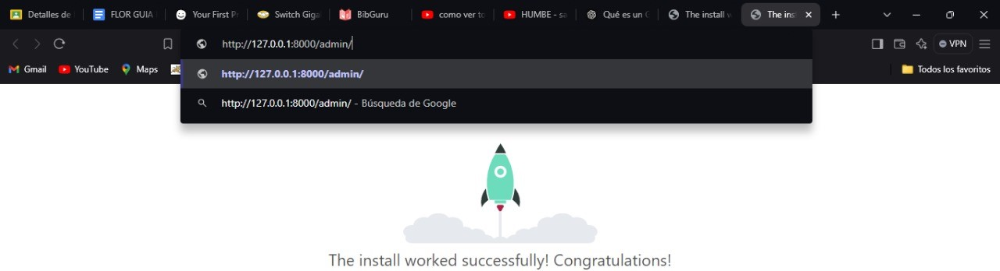

16.	Para poder ingresar nos solicitará el usuario y contraseña, colocaremos los datos que colocamos anteriormente y nos dará el acceso a la aplicación.
Dentro de ello, podemos realizar varias actividades como:
•	Gestionar modelos: Crear, leer, actualizar y eliminar entradas de los modelos que has definido en tu aplicación.
•	Administrar usuarios: Añadir, editar o eliminar usuarios y gestionar sus permisos.
•	Configurar permisos: Establecer permisos personalizados para diferentes usuarios y grupos.
•	Añadir contenido: Subir archivos, gestionar imágenes y editar datos relacionados con tu sitio.

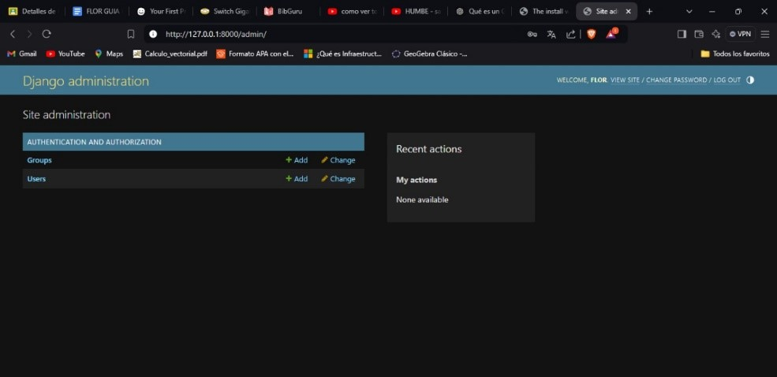

17.	 Cada vez que deseemos cerrar sesión o salir debemos de desactivar el entorno virtual.

